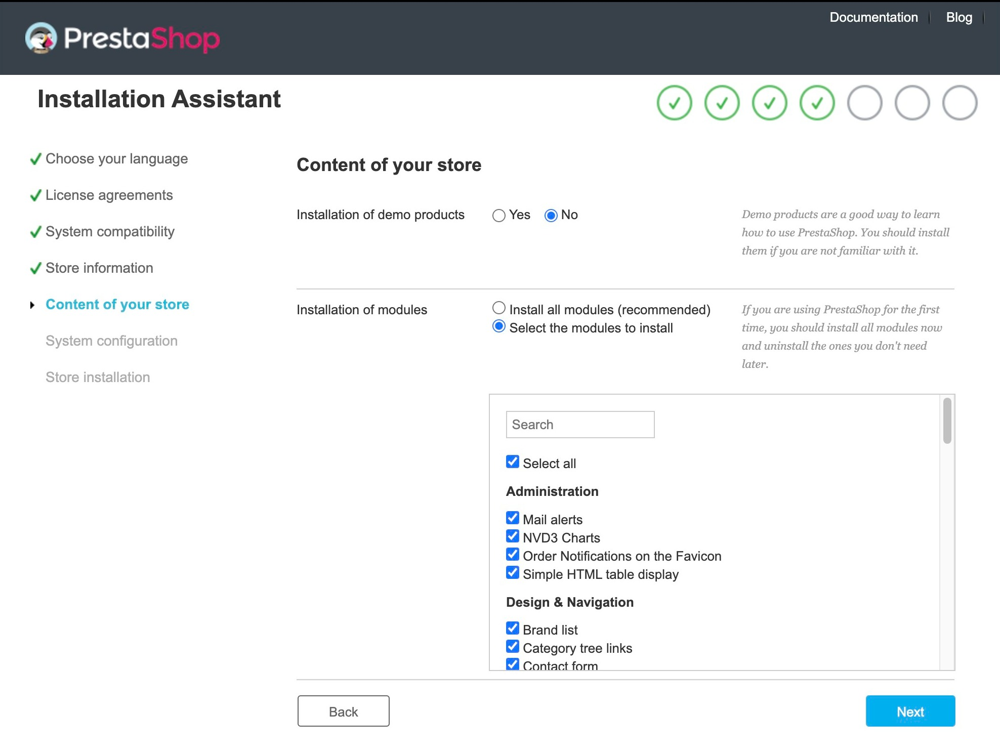

# Installing PrestaShop


This chapter was written for those who intend to install PrestaShop on **their online web server.**

\
If you wish to install PrestaShop on your own computer, you should first follow the instructions on this page: [Installing PrestaShop on your computer](installing-prestashop-computer.md)[.](https://docs.prestashop-project.org/v.8-documentation/v/english/getting-started/installing-prestashop-computer)

If you have already read the instructions on that page, skip to the [**"Creating a database for your store"**](installing-prestashop.md#creating-a-database-for-your-store) section of this current page.


## Installation

PrestaShop should not be hard to install. Once you've uploaded all your files on your web server, you should be able to start configuring your store in no less than 5 minutes in most cases: the installation process is very simple because the installer takes care of everything for you.&#x20;

Note that less experienced users might need between 10 and 20 minutes to complete the whole process.

Before you get started, make sure you meet **all installation requirements:**&#x20;

* **you have enough server space at a hosting provider,**&#x20;
* **a domain name,**&#x20;
* **an FTP client,**
* **a text editor.**

Everything you need is listed on the **"What you need to get started"** page, available here:&#x20;


[what-you-need-to-get-started.md](what-you-need-to-get-started.md)


Our web hosting partner **IONOS** offers a 1-click install in order to save you time and get you started even faster. Using these can drastically reduce the installation time for inexperienced users:

* [IONOS Hosting](https://www.ionos.com/ecommerce-solutions/prestashop-hosting?ac=OM.US.USs96K414029T7073a)&#x20;

You can also save time with our partner **InMotion**, and get PrestaShop pre-installed. It allows users with few technical skills to quickly start working on a scalable solution.

* [InMotion Hosting](https://inmotion-hosting.evyy.net/c/1322143/260033/4222?u=https%3A%2F%2Fwww.inmotionhosting.com%2Fprestashop-hosting)

Those web hosts mostly use the following script libraries:

* [Installatron](http://installatron.com/apps?locale=en#cmd=browser\&display=prestashop)
* [Softaculous](http://www.softaculous.com/apps/ecommerce/PrestaShop)

Some of these scripts even support 1-click updates. Other hosts have their own installation scripts — check with your own host for more information.


Be careful with 1-click updates provided by tools from hosting companies. It is recommended to check them on the copy of your store first.


## Quick installation instructions

Here's a quick set of instructions for those who are already comfortable with installing PHP/MySQL applications on a web server.&#x20;

If you need more details, you can find detailed instructions in the next section of this chapter.

1. **Download and unzip** the PrestaShop package if you haven't already.
2. **Create a database** for your PrestaShop store on your web server if possible. If no MySQL user has all privileges for accessing and modifying this database, you will need to create them.
3. **Upload** all available PrestaShop files to the chosen location on your web server, including the .zip file (it will unzip itself afterward).
4. **Run** the PrestaShop installation script by accessing the public URL for the chosen location in a web browser. This should be the URL where your uploaded PrestaShop files are available.
5. **Follow** the installer's instructions.
6. Once the installation is done, **delete the `/install` folder** and **write down a new name for your `/admin` folder,** which has been generated specifically for you (for security reasons).

PrestaShop should now be installed and ready to be configured! Continue to the [First steps with PrestaShop 8](../user-guide/first-steps.md) chapter of the User Guide.

## Detailed instructions

### Downloading and unzipping the PrestaShop archive

You can download the latest version of PrestaShop on GitHub, here: [https://github.com/PrestaShop/PrestaShop/releases](https://github.com/PrestaShop/PrestaShop/releases)&#x20;


You do **not need a GitHub account** to download PrestaShop.


<figure><figcaption>
PrestaShop 8.1.0's GitHub release page.
</figcaption></figure>

Here, you can download the latest stable version, which is ready for all kinds of online stores.


If you need to download any of the previous versions, scroll down the GitHub release page and find the version you wish to download.&#x20;

To benefit from the latest features and security fixes, it is **highly recommended** to use the current stable version (marked as "Latest") and avoid any other versions.


**Click** on the version you wish to download, expand the **"Assets"** section, and save the .zip archive on your computer (on your Desktop, for example):

<figure><figcaption>
PrestaShop 8.0.4's release page. The Assets section is at the bottom of the Releases page.
</figcaption></figure>

You should get a file named "prestashop\_X.Y.Z.zip" (prestashop\_8.1.0.zip for example, or an equivalent, depending on the version you download).

The downloaded file is a zip archive. In order to continue, **you must uncompress the archive**.

If your operating system does not natively support Zip files, you can download and install a dedicated tool, such as:

| Windows                                                                                                               | MacOS                                                                                                 |
| --------------------------------------------------------------------------------------------------------------------- | ----------------------------------------------------------------------------------------------------- |
| 
<strong>7-Zip</strong>

<a href="http://www.7-zip.org/">http://www.7-zip.org/</a>
                         | 
<strong>iZip</strong> <a href="http://www.izip.com/">http://www.izip.com/</a>
               |
| 
<strong>WinZip</strong> <a href="http://www.winzip.com/win/en/index.htm">http://www.winzip.com/win/</a>
     | 
<strong>WinZip</strong> <a href="http://www.winzip.com/mac/">http://www.winzip.com/mac/</a>
 |
| 
<strong>WinRAR</strong> <a href="https://www.win-rar.com/start.html?&#x26;L=10">https://www.win-rar.com</a>
 | The recent MacOS versions allow you to unzip files natively.                                          |

Extract the content of the archive using your Zip utility to the location of your choice on your hard drive. You can extract it on your desktop if you wish.


**Do not upload a file named "prestashop\_X.Y.Z.zip"  directly to your web server**. **You must unzip it first.**


The Zip archive has a few items at its root :

* **The "prestashop.zip":** which contains all the PrestaShop files that you will soon be uploading to your web server.
* **The "Install\_PrestaShop.html" file:** opens the same page in your default browser.
* **The index.php file:** launches the installation.


"Install\_PrestaShop.html" **must not be uploaded on your web server.**


### Uploading PrestaShop

You should now have a hosting space at your disposal and a folder on your hard drive with the uncompressed PrestaShop archive.

This step helps you upload the PrestaShop files on your hosting space. This is done by **connecting your computer to your server using a tool known as an "FTP client",** which you should have installed already.&#x20;

For this example, we will use FileZilla Client, a free FTP client, available here: [http://filezilla-project.org](http://filezilla-project.org/).

1. **Connect to your hosting space** using your FTP client, by using the connection details provided by your web host (if not, contact your host).&#x20;
2. Once connected, **transfer the PrestaShop files** from your computer to your server.
3. In your FTP client, **browse your local folders** until you find the one that contains the PrestaShop files, and **keep it open** in the "Local site" section on the left, like this:

.png>)

4. In the "Remote site" section (on the right), **browse to the location where you want PrestaShop to be publicly available** (at the root of the domain, sub-folder, sub-domain, etc). This can change a lot, depending on both your host and your needs:

#### **Your host:**

* Some hosts may require you to place your files in a specific folder, such as `/htdocs`, `/public_html`, `/web`, `/www`, `/`[`yourdomainname.com`](http://yourdomainname.com), /domains/yourdomainname.com/public\_html/, etc.
* Other hosts' FTP servers will simply log you directly into the proper upload space.

#### **Your needs**

* If you want your store to be **the main website for your domain name** (i.e., [http://www.example.com](http://www.example.com/)):
  * **Upload PrestaShop to the root folder** of the upload space (which may depend on the host).
* If you want your store to be **in a sub-folder of your domain name** (i.e., [http://www.example.com/store](http://www.example.com/shop)):
  * **Create a folder** through FileZilla (right-click and choose "Create directory"), then **upload PrestaShop to that folder.**
* If you want your store to be **in a sub-domain of your domain name** (i.e., [http://store.example.com](http://shop.example.com/))
  1. &#x20;**Create a sub-domain.**&#x20;
  2. Once created, **browse to the sub-domain's folder**, and **upload PrestaShop there**.


This step depends on your host.&#x20;

You might be able to create a sub-domain by adding a new folder with your FTP client, or you might have to create the sub-domain through your host's administration panel.&#x20;

Read your host's support documentation first.


On FileZilla's left side, you should now have the local folder where you keep the PrestaShop files previously extracted from the Zip archive. On the right side, you'll find the destination location.&#x20;

If you haven't uploaded it yet, it should be straightforward:&#x20;

1. **Select** all PrestaShop release files from the local folder (you can use Ctrl+A),&#x20;
2. Either **drag & drop** your three files to the remote folder or **right-click** on the selection and choose **"Upload"** in the context menu.

### Creating a database for your store

Before you install PrestaShop, you need to make sure your MySQL/MariaDB server has a database ready for PrestaShop's data. If not, **you must create one.**

Creating a database can be done using any database administration tool. We will be using the free phpMyAdmin tool ([http://www.phpmyadmin.net/](http://www.phpmyadmin.net/)). It should come pre-installed on most web hosting services.


Some hosts prefer customers to use a graphic control panel, such as cPanel, Plesk, DirectAdmin, or a custom-made one. Make sure you read your host's documentation about handling MySQL databases, and create a database for your store by following their specific explanations.


**To create a database, connect to phpMyAdmin** using your account credentials, which your host provided you with. It should be accessible through a standard URL, tied to your domain name, or the host's domain name.

In the left column, you can see the databases currently available on your MySQL server.&#x20;


Some of them should be left alone because they are either used by phpMyAdmin or by the host, like **`phpmyadmin, mysql, information_schema, performance_schema`** and others.&#x20;

Read your host's documentation to know if one of these can be used as a default database.


1. To **create a brand new database,** go to the "Database" tab and use the central form untitled **"Create new database"**.&#x20;
2. Simply **enter a unique name**, and click **"Create"**. The name of the database will be added to the list on the left. You can now use your database to store PrestaShop's data.

### Launching the auto-installer

Here comes the part where it all comes together: installing PrestaShop.

The installation process is quite fast and straightforward, as it is streamlined by PrestaShop's auto-installer. You should be able to browse through it in a handful of minutes. Make sure to read each page thoroughly so as not to miss any information.

To launch the installer:

1. **Browse to PrestaShop's location** on your web server: the script will automatically detect that PrestaShop is not yet installed, and will take you to the auto-installer.&#x20;
2. At the same time, this will unzip the prestashop.zip file that you uploaded.&#x20;
3. Now all the PrestaShop files are available on your webserver.


Did you encounter any issues while trying to install PrestaShop? Find help using the Support page, available here: [https://www.prestashop-project.org/support/](https://www.prestashop-project.org/support/)


From there on, you just have to read, click, and fill out a few forms.

There are **6 steps**. At the top of the page, the installation assistant gives you a visualization of where you are in the process: the gray circles turn into green check marks after each step is completed.

 (5).png>)

## **Step 1: Welcome page**

This page is a quick intro to the installation process. You can choose the language in which the installer will display its instructions.

<figure><figcaption>
PrestaShop's Installation Assistant, step 1: Welcome to the PrestaShop Installer.
</figcaption></figure>

**Select the language** in which you wish the installer to be, then click the **Next** button.&#x20;

This will also **set the default language for your PrestaShop** installation. Other languages will also be available for you to enable later on.


You also get a link to the documentation site ([https://docs.prestashop-project.org/welcome/](https://docs.prestashop-project.org/welcome/)) and a link to our project's blog.&#x20;

You can visit the project's blog by going to [https://build.prestashop-project.org/](https://build.prestashop-project.org/).


## **Step 2: PrestaShop's licenses**

This second page is a simple requirement. PrestaShop is free and distributed under a certain set of open-source licenses. You simply cannot use this software if you disagree with the terms of the licenses, and this step requires you to explicitly acknowledge them.

<figure><figcaption>
 PrestaShop's Installation Assistant, step 2: License Agreements.
</figcaption></figure>

**You must agree to both licenses** in order to install PrestaShop.

To access the next step, you must check the **"I agree to the above terms and conditions"** box, then click **Next.**&#x20;

If you do not explicitly agree to the licenses, you cannot install PrestaShop as you will not be able to click on the Next button.


Learn more about PrestaShop's licenses:

* _**Open Software License 3.0**_ for PrestaShop itself, which you can also read at [http://www.opensource.org/licenses/OSL-3.0](http://www.opensource.org/licenses/OSL-3.0).&#x20;
* _**Academic Free License 3.0**_ for the modules and themes, which you can also read at [http://opensource.org/licenses/AFL-3.0](http://opensource.org/licenses/AFL-3.0).


## **Step 3: System compatibility**

The third page makes a quick check of all the server parameters on your host.&#x20;

In most cases, you will not see this page, because if nothing wrong is found, you are directly taken to the fourth page ("Store information"). If so, you can still go have a look at the third page by clicking on the "System compatibility" link in the left sidebar.


If something goes wrong during the server check that happens in the third step, the installer displays the "System compatibility" page, where you can see all the checks that failed.


### **System compatibility**

This page checks that everything is OK with your server configuration: PHP settings, permissions on files and folders, third-party tools, etc.

<figure><figcaption>
 PrestaShop's Installation Assistant, step 3: Checking system compatibility.
</figcaption></figure>


If anything goes wrong, the installer stops you here: you can see the few technical details that need fixing, be it changing the PHP configuration or updating the file permissions.


<figure><figcaption>
 PrestaShop's Installaton Assistant, step 3: System compatibility failed.
</figcaption></figure>

Here is a list of the checks that are performed during this third step:

| PrestaShop checks:                                                     | How can I fix it? (check for...)                                                                          |
| ---------------------------------------------------------------------- | --------------------------------------------------------------------------------------------------------- |
| Is the minimum or newer compatible PHP version installed?              | webserver                                                                                                 |
| Can PrestaShop upload files?                                           | php.ini file (`file_uploads`)                                                                             |
| Can PrestaShop create new files and folders?                           | File browser / FTP client / command line                                                                  |
| Is the GD Library installed?                                           | php.ini file (`extension=`[`php_gd2.so`](http://php\_gd2.so))                                             |
| Is MySQL support is on?                                                | php.ini file (`extension=`[`php_pdo_mysql.so`](http://php\_pdo\_mysql.so))                                |
| Recursive write permission on \~/config/                               | File browser / FTP client / command line                                                                  |
| Recursive write permission on \~/cache/                                | File browser / FTP client / command line                                                                  |
| Recursive write permission on \~/log/                                  | File browser / FTP client / command line                                                                  |
| Recursive write permission on \~/img/                                  | File browser / FTP client / command line                                                                  |
| Recursive write permission on \~/mails/                                | File browser / FTP client / command line                                                                  |
| Recursive write permission on \~/modules/                              | File browser / FTP client / command line                                                                  |
| Recursive write permission on \~/override/                             | File browser / FTP client / command line                                                                  |
| Recursive write permission on \~/themes/default\_theme\_name/lang/     | File browser / FTP client / command line                                                                  |
| Recursive write permission on \~/themes/default\_theme\_name/pdf/lang/ | File browser / FTP client / command line                                                                  |
| Recursive write permission on \~/themes/default\_theme\_name/cache/    | File browser / FTP client / command line                                                                  |
| Recursive write permission on \~/translations/                         | File browser / FTP client / command line                                                                  |
| Recursive write permission on \~/upload/                               | File browser / FTP client / command line                                                                  |
| Recursive write permission on \~/download/                             | File browser / FTP client / command line                                                                  |
| Recursive write permission on \~/app/config/                           | File browser / FTP client / command line                                                                  |
| Recursive write permission on \~/app/Resources/translations/           | File browser / FTP client / command line                                                                  |
| Can PrestaShop open external URLs?                                     | [php.in](http://php.in) file (`allow_url_fopen`)                                                          |
| Is PHP's "register global" option off?                                 | php.ini file (`register_globals`)                                                                         |
| Is GZIP compression activated?                                         | .htaccess file                                                                                            |
| Is the Mcrypt extension available?                                     | php.ini file (see [http://php.net/manual/en/mcrypt.setup.php](http://php.net/manual/en/mcrypt.setup.php)) |
| Is PHP's "magic quotes" option deactivated?                            | php.ini file (`magic_quotes_gpc`)                                                                         |
| Is the Dom extension loaded?                                           | `--enable-dom` compile time option                                                                        |
| Is the PDO MySQL extension loaded?                                     | php.ini file (`extension=`[`php_pdo_mysql.so`](http://php\_pdo\_mysql.so))                                |

### Updating file permissions


Changing the PHP configuration can only be done on a case-by-case basis (depending on your level of access to your server) and, therefore, can't be explained in full detail. If your server doesn't meet requirements consider contacting hosting support.



On most servers, you shouldn't be forced to change any permissions. Contact hosting support first to consult the configuration if you must do it.


Updating the file permissions, however, is easier to explain:

Permissions are the way a filesystem grants access rights to specific users or user groups, controlling their ability to view or make changes to files and folders. The installer needs to make several changes to the files that you uploaded, and if the filesystem does not allow for these changes through proper permissions, then the installer cannot complete its process.

If the installer shows that some files or folders do not have the right permissions, you have to change these permissions yourself. This will require you to access your files on your web server and, therefore, use your FTP client (such as FileZilla) or the command line.

**To update your file permissions,**&#x20;

1. **Log in** to your server account using your FTP client
2. **Browse** to PrestaShop's folder, and find the folders that are marked by the installer as **needing a permission change.**

### Updating CHMOD

Changing file or folder permission on a Unix/Linux system is called a **"CHMOD"**. It's named after the command of the same name (see: [http://en.wikipedia.org/wiki/Chmod](http://en.wikipedia.org/wiki/Chmod)).

If you wish to learn more, you can find an explanation on file permissions here: [http://www.elated.com/articles/understanding-permissions/](http://www.elated.com/articles/understanding-permissions/)\

Giving files or folders a "write permission" is called " a "CHMOD 775". The name can sometimes vary depending on your host.


Some hosts might require you to use CHMOD 777, although **it is not recommended** for anything more than a one-time need.

\
If you have to use CHMOD 777 in order to install PrestaShop, make sure to switch to a safer setting (for instance, 775 for folders and 664 for files) once you are done installing.&#x20;

Read your host's documentation carefully.


Thanks to FileZilla (and most FTP clients), you do not have to use any Unix command. Most FTP clients make it possible to change permissions easily and graphically.

Once you have found a file or folder that needs such a change,&#x20;

* **Right-click on it**, and in the context menu choose **"File permissions"**. It will open a small window.

 (2) (1).png>)

Depending on your server configuration (which you can't always edit), you will need to check both the **"Read"** and **"Execute"** columns of boxes, and at least the **"Owner"** and **"Group"** rows for the **"Write"** column.&#x20;


Some hosts might require you to have the public "Write" box checked.&#x20;

Be careful with that: **it is rarely a good thing to give anyone permission to edit your PrestaShop installation's content.**


Some folders might need to have all their files and sub-folders change permissions too. In that case, check the **"Recurse into subdirectories"** box.

While changing permissions in your FTP client, you should regularly check that you have made the correct changes by running the installer's compatibility checks again. Click the installer's **"Refresh these settings"** button as often as necessary. **Once all indicators are green**, you can click **"Next"**.&#x20;

If you cannot have them all green, at least make sure the installer displays the **"PrestaShop compatibility with your system environment has been verified!"** message at the top of the page.

## **Step 4: Store information**

This is where you can start customizing your store. You can give it a name, choose its main activity, and indicate the personal information of the store owner (which has legal bindings in most countries).


**Do not use a colon in your store's name,** as it might prevent some features from working (for instance, e-mail sending might fail).

You can replace the colon with **a dash** if you need to have two sections in the title.&#x20;

For instance, use "MyStore – The best place for items to buy" instead of "MyStore: The best place for items to buy".


<figure><figcaption>
 PrestaShop's Installation Assistant, step 4: Information about your Store.
</figcaption></figure>

This is also where you choose the password to log in to the administration panel of your store - choose wisely so that you will remember it, but make sure it is secure too!

Click **"Next"** to continue.

## Step 5: Content of your store

This page provides a form that allows you to choose which modules to install with your store and opt-in or out of demo products.

<figure><figcaption></figcaption></figure>

## **Step 6: System configuration**

This page contains a form that enables you to tell PrestaShop where the database server is, which database it should use, and some other details.&#x20;

All these details should be provided to you by your webhost.

<figure><figcaption>
 PrestaShop's Installation Assistant, step 5: Database configuration.
</figcaption></figure>

**Fill all the fields** with the database connection information provided by your web host:

* **Database server address:** The hostname of your MySQL server. It can be tied to your domain name (i.e. [http://sql.example.com](http://sql.example.com/)), tied to your web host (i.e. [http://mysql2.alwaysdata.com](http://mysql2.alwaysdata.com/)), or simply be an IP address (i.e. 46.105.78.185).
* **Database name:** The name of the database where you want PrestaShop to store its data. This is either an existing database on your MySQL server or the one that you created using phpMyAdmin (or any other SQL tool) in the ["Creating a database for your shop"](installing-prestashop.md#creating-a-database-for-your-store) section of this guide.
* **Database login:** The name of the MySQL user that has access to your database.
* **Database password:** The user's MySQL password.
* **Tables prefix:** The prefix for your database tables. The default prefix is "`ps_`", resulting in the PrestaShop SQL tables having names such as "`ps_cart`" or "`ps_customer`".


**We strongly recommend customizing your database prefix instead of using the default one.**&#x20;

If you need to install more than one instance of PrestaShop on the same database, then **you must use a different prefix for each installation**. However, we do recommend that you create one database per installation of PrestaShop if your web host allows it.&#x20;

Better yet: make one installation of PrestaShop, and enable the [multistore feature](../user-guide/configuring-shop/advanced-parameters/multistore.md) in order to manage many stores from the same PrestaShop back office.


* **Drop existing tables:** This is only available in "Dev mode". When re-installing PrestaShop, you can choose to drop the existing PrestaShop database tables in order to start with a clean slate.

1. Click the **"Test your database connection now!"** button in order to check that you used the correct server information.
2. Click **"Next".** The installation assistant will start configuring your store, creating and populating the database tables, etc.&#x20;

This might take a few minutes, don't close this window.

<figure><figcaption>
 PrestaShop's Installation Assistant, step 6:  Database tables creation.
</figcaption></figure>

The installer does the following:

* Create the configuration files and fill them with your settings.
* Create the **database tables.**
* Create the **default store** with its default languages.
* Populate the **database tables.**
* Configure the **store's information.**
* Install the **selected modules**.
* Install **demo data** (if you opt-in to it, products, categories, customers, CMS pages, etc.).
* Install the **theme.**

Once it is done, your store is installed and ready to be configured!

## Completing the installation

As you can read right on the final page of the installation process, **there are a couple of last actions left before you can leave the installer.**

<figure><figcaption>
 PrestaShop's Installation Assistant, final step: Installation complete.
</figcaption></figure>

An easy way to improve your installation's security is to delete some key files and folders. This is done using your FTP client, directly on the server.&#x20;

The items you can delete are:

* The "/install" folder **(you must delete this folder).**
* The "/docs" folder _**(you can delete this folder)**_, unless you need to test the import tool with the sample import files that this folder contains.
* The "[README.md](https://www.makeareadme.com/)" file _**(you can delete this file**_**)**.

Click on the **"Manage your store"** button to access your administration area.


Another way to secure your installation is to use a custom name for the administration folder: change the "admin" folder for something unique to you, such as "4dmin-1537" or "MySecUReD4dm1n".


\
**Write down the new name for your new "admin" folder:** from now on, you will access your administration pages using this address.

Finally, to shut any potentially malicious doors, use your FTP client to update the files and folders permissions to 664, or 666 if your host requires it.&#x20;

If it turns out low access rights prevent some modules from working, you should set permissions back to 755.

## **Congratulations, your PrestaShop installation is now complete!**

To continue customizing your PrestaShop store, **log in to the PrestaShop back office** by going to your newly-renamed "admin" folder. &#x20;

You're free to:

* &#x20;[Fill your catalog with products](https://docs.prestashop-project.org/v.8-documentation/v/english/user-guide/selling/managing-catalog/managing-products),
* Add [carriers](https://docs.prestashop-project.org/v.8-documentation/v/english/user-guide/improving-shop/managing-shipping/carriers) and [shipping costs](https://docs.prestashop-project.org/v.8-documentation/v/english/user-guide/improving-shop/managing-shipping),&#x20;
* Add [brands](https://docs.prestashop-project.org/v.8-documentation/v/english/user-guide/selling/managing-catalog/managing-brands) and [suppliers](https://docs.prestashop-project.org/v.8-documentation/v/english/user-guide/selling/managing-catalog/managing-suppliers),&#x20;
* Change your [theme](https://docs.prestashop-project.org/v.8-documentation/v/english/user-guide/improving-shop/customizing-store-design/theme-and-logo).

And configure the many settings to suit your tastes and needs. See the user guide's "[First steps with PrestaShop 8](../user-guide/first-steps.md)" chapter for more information.


You should regularly[ **back up your database and files**](https://devdocs.prestashop-project.org/8/basics/keeping-up-to-date/backup/), ideally on more than one computer, in case of problems related to hardware or security.



_This page has been recently updated!_

**🗣 What did you think of this article? Let us know!**&#x20;

Your feedback helps us improve PrestaShop's documentation for everyone! 🙌

You can use the emojis on the bottom right of this article to let us know what you think about this article ⬇️

