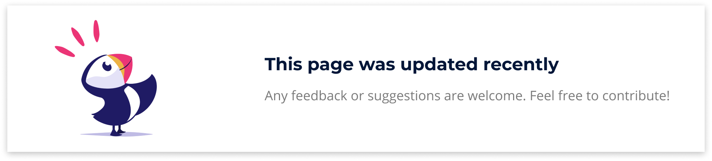
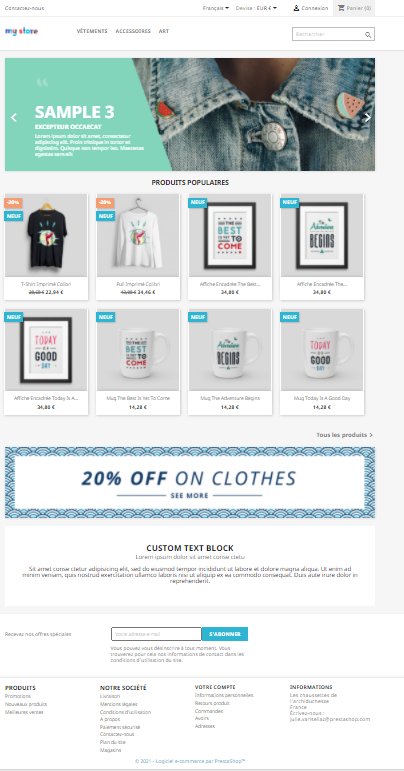

# Browsing the front office

:arrow\_right:[Contribute](https://prestashop.gitbook.io/howtocontribute/)

The front office is the visible part of your site. It is what customers see when browsing your store and throughout the buying process.

As a merchant, you should know your front office like the back of your hand, not only because you owe it to yourself to know your shop inside and out, but also because you need to understand what your customers face, the number of pages and clicks they go through during a typical buying session, where they might get stuck and how to help them out, etc.

Even if you think you know your front office by heart, don't forget to go back from time to time as if you were a user visiting the site for the first time. Browse your store, buy a product, contact customer service... put yourself in your customers' shoes! You might make some discoveries and note some points to improve.

Note that this page of documentation will be based only on the default theme, settings, and modules. Indeed, enabling other modules or using another theme could drastically change the shopping experience.


If you want to change your theme, you can choose one among the large choice of themes available on [PrestaShop Addons](https://addons.prestashop.com/en/3-templates-prestashop).


## The default theme

PrestaShop comes with a default theme that uses a simple, clean, gray and white design. This minimalism makes it suitable for almost any industry. It was designed to be easy to browse, ergonomic, standard-compliant, and adapted to all screen sizes and devices.

If you installed PrestaShop with its sample data, you will see clothing products and home accessories.&#x20;

## Browsing the store

The header is a thin bar of content at the top of the page, accessible from all the front office pages.&#x20;

The header is divided into two parts.&#x20;

The upper part of the header contains:

 (1).png>)

* **A link to the contact page**&#x20;
* **A language selector:** if more than one language is available on the store, customers can choose in which language they want to see the store.&#x20;
* **A currency selector:** if more than one currency is available on the store, customers can choose in which currency they want to see the prices of the products displayed. This can be very useful when comparing prices with other international stores.&#x20;
* **A link to the authentication page:** once logged in, customers have access to their account and a "Sign out" link appears next to their name.
* **A link to the customer's shopping cart:** at a glance, customers can see how many items there are in their cart. They can also click on the "Shopping cart" button to access the content of the cart and finalize their order.

The lower part of the header is larger, it contains:

 (1) (1).png>)

* **The store logo:** by clicking on this logo, customers will be automatically redirected to the homepage of the store. Don't forget to change the default logo by adding your own from the Design > Theme & Logo page of the back office!
* **The menu:** by default, the categories "Clothing", "Accessories" and "Art" are displayed, and subcategories appear on mouseover. To customize the menu with your own categories, you must configure the "Main Menu" module.&#x20;
* **The search bar:** essential to facilitate the search on your store, the search bar allows customers to quickly find the items of their choice thanks to keywords.


The fuzzy search option now takes into account possible typos in the entries your visitors search for!&#x20;


### **The central section**

The default homepage gives the customer a broad overview of the store and its possibilities. What do you want to show your customers?&#x20;

At the top of the page, there is an image slider: three images scroll by. You can configure this slider with the help of the module "Image slider" to highlight your new collections, promotions, etc.

Just below the image slider are displayed the popular products of your store.

You can also customize a banner or add a text block. Feel free to have a look at the dedicated documentation to learn how [to configure the front office pages of your store.](improving-shop/customizing-store-design/theme-and-logo.md#pages-configuration)

### The footer

The footer is divided into two parts.

 (1).png>)

:arrow\_right:The upper part of the footer contains a subscription block for your newsletter, allowing customers to receive special offers. This subscription form is managed by the "Newsletter subscription" module.

 (1).png>)


Please note that sending the newsletter is your responsibility. With the "Newsletter" module you can generate a .csv file containing all registered customers and their e-mails. You will then be able to import this file into any emailing system.


The lower part of the footer contains 4 blocks giving access to very useful pages for your customers:



**The "Products" block allows quick access to the following pages:**&#x20;

* Promotions&#x20;
* New products
* Best sales



**The "Our company" block allows quick access to the following** **pages:**&#x20;

* Delivery&#x20;
* Legal Notice&#x20;
* Terms and conditions of use&#x20;
* About us&#x20;
* Secure payment
* Contact us&#x20;
* Sitemap&#x20;
* Stores



**The "Your account" block redirects to the main pages of the customer account (or the authentication page, if the customer is not logged in):**

* Personal info
* Orders
* Credit slips
* Adresses



**The "Store information" block contains all the information about your store:**

* The name of the store
* The address
* The phone number
* The email



### The category pages

#### The left column

 (1) (1).png>)

A category is a hierarchical way of sorting products: it can contain an unlimited number of subcategories, which allows you to easily switch from general listings to more specific products by following a logical path.&#x20;

A PrestaShop store can have as many categories and subcategories as needed, with an infinite number of products in a given category level.&#x20;

On the category pages, in the left column, customers can see in which category or subcategory the product is.&#x20;

Please note that all categories are subcategories of the root category, "Home". You can configure the categories from your back office, on the Catalog > Categories page.


[managing-categories.md](selling/managing-catalog/managing-categories.md)


#### The "Filter by" block

Filtering their search allows customers to find the product they are looking for faster. On the left column of a category page, it is possible to refine a search by filtering it by attributes, characteristics or price range. The "Filter by" block can be configured via the "Faceted Search" module.

#### The category header

 (1).png>)

Categories have a header image and a description. You can configure this header from your back office on the Catalog > Categories page.&#x20;

### Product listings&#x20;

All product lists are identical on PrestaShop, regardless of the nature of the page concerned (new products, best sellers, category pages, etc). Products are organized in a grid, with:

* A thumbnail image&#x20;
* Promotional or status flags at the top left of the image&#x20;
* The name of the product
* The price of the product

.png>)

This presentation in a grid allows customers to see the main product information at a glance, therefore speeding up the decision-making process.

On mouseover, customers can click on the magnifying glass to access a quick overview of the product. They will then have access, in addition to the information previously stated, to the product description, and will be able to add the product to their cart after having selected the attributes (if any) and entered the desired quantity.

 (1).png>)

#### Products sorting

Products can be sorted by price (high to low or low to high), name (A to Z or Z to A), or by relevance.

### The product page

 (1).png>)

The product page presents the information you entered from the Catalog > Products page of your back office. Depending on the theme used, a product page can be very complete, with detailed information, or simply present the essential information.

The default theme allows you to display one or more product images. Next to the images, other information about the product appears: the product name, the price and possible discounts, and a short summary.&#x20;

Just below this product information, customers can choose from the available combinations (if any) and select the desired quantity.&#x20;

Below the "Add to cart" button, reassurance elements inform your customers about the different payment, delivery, return policies, etc. To modify this information, you must configure the "Reassurance" module.&#x20;

Finally, at the bottom right of the page, a block displays two tabs:&#x20;

**Description:** here appears a complete description of the product, as it was entered in the back office.&#x20;

**Product details:** this tab only appears if characteristics have been associated with the product from the back office, for example, the brand or the composition.&#x20;

For more information on the configuration of the product page, please visit the [dedicated documentation page.](selling/managing-catalog/managing-products.md)

### The cart

From the header, customers can see how many items are in their cart. By clicking on the "Cart" button, customers can access the content of the cart and finalize their order.

 (2).png>)

A summary of the content of the cart is displayed. After checking that the content of the order is correct, customers can click on the "Proceed to checkout" button. They are then redirected to the checkout page.

## Buy a product&#x20;

Once the shopping cart is filled with all the desired items and the ordering process is started, customers will have to validate a series of steps until the validation of their order.&#x20;

PrestaShop makes sure that the purchase process is fast and efficient. This process takes place in 5 steps:&#x20;

**Personal information:** if the customer is not connected, they can choose to order as a guest, create an account or log in.

**Addresses:** If no address has been previously registered, the customer must fill in the address creation form. Otherwise, they can directly select the address to which they want to be delivered. If the delivery address and the billing address are different, the customer can uncheck the box "Use the same address for billing" and either select an address from those already entered or enter a new one.

**Shipping method:** this is where the customer must choose from the delivery and packaging options. Depending on what the store offers, the customer can choose a recycled package and/or gift wrap for their order. The customer can take advantage of this step if they wish to share a message about their order.

**Payment:** the customer can choose several payment options depending on what the merchant has set up. The customer clicks on the chosen method and depending on it, they are either sent to the third party vendor's manager or to a page in PrestaShop where they can enter the necessary details. PrestaShop makes it easy to add payment methods like PayPal, Hipay, or other third-party providers. Go to the "Modules" page of the back office to discover all the payment modules available natively, and discover many others on the Addons marketplace.

**Validation and summary:** once the customer has validated everything and accepted the general sales conditions, their order is confirmed, and they can access the summary of his order. Depending on the payment method chosen, some final information may be sent to the customer, with a notification of the confirmation by e-mail and a link to the support page. The customer must click on "I confirm my order" in order to have it validated.

## Create a customer account


PrestaShop allows the visitors of your store to create an account simply and quickly!


By clicking on "Sign in" in the header, visitors are redirected to an authentication page. If they do not have an account, they can create one from the same page.

The account creation form is composed of two parts:&#x20;

**Personal information:** customer indicates their personal information (name, first name, e-mail, password, and date of birth). This functionality is managed by the "Customer 'Sign In' link" module.&#x20;

**Subscriptions:** customers can choose to subscribe to your newsletter and to receive or not your partner offers. Make sure to display these fields only if you actually send this type of content.&#x20;

Once registered, customers access their customer account where many options are available. In particular, they can add a first address - their default address, but they can have more! If the customer has only one address registered, it will be used as both the shipping and billing address. During the checkout process, the customer can always choose to use a different address.


Guest checkout (feature available on the Shop Parameters > Order Settings page) allows visitors to purchase products without creating an account. Essential delivery and payment information is still required but the customer will never have to create a password.

