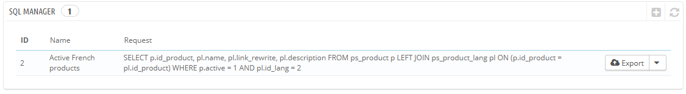

# SQL Manager

The SQL manager is a complex feature, which should be reserved for technical people who know how to explore a database using the SQL language. In return for this complexity, it can be extremely powerful and proves immensely useful to those who master it.

This tool enables you to perform SQL queries directly on the PrestaShop database, and save them for use at any later time. Indeed, PrestaShop presents its database data in many ways, but you might need something more, or more simply, something rawer than PrestaShop's clean interface. Using the SQL manager you can perform complex queries which build upon tables of data in the way YOU need them.\
For instance, using this tool and your knowledge of SQL, you could create a reusable query giving you an updated list of the clients who are subscribed to your newsletter, or get a list of products in HTML or CSV format.

For security reasons, some types of queries are not allowed: UPDATE, DELETE, CREATE TABLE, DROP, etc. In short, you can only read data (SELECT query).

Also, secure keys or passwords are hidden (\*\*\*\*\*\*\*\*\*\*\*).

## Creating a new query 

As usual, the "Add new SQl query" button leads to the creation form. It has two main fields:

* **SQL query name**. Make the name as long and descriptive as necessary.
* **SQL query**. The SQL query itself. You are free to perform JOINs or other intricate selections.

 (4).png>)

Additionally, the "List of MySQL Tables" section helps you explore the database, and makes it easier for you to build your queries. It gives you a handy and clickable selector of all the currently available database tables. Select a table to make PrestaShop display its attributes and types, then click "Add attribute to SQL query" to send its name into the "Request" field.

 (4).png>)

Saving the form sends you back to the main page, with its list of queries.

## Starting a query 

Each saved query in the table has four icons to the right of its row:

* **Export**. Performs the query, and has it downloaded by you in CSV format.
* **View**. Performs the query, and has it displayed in an HTML table, right within the PrestaShop interface.
* **Edit**. You can edit a query as often as necessary, in order to refine it and get better results.
* **Delete**. Once a query is not used anymore (or simply because it does not work), you can delete it by clicking this button and confirming your choice.

 (4).png>)

## Settings 

There is only one setting at this time:

* **Select your default file encoding**. You can configure the character encoding of the downloaded CSV file. The default, UTF-8, is recommended, but you can select ISO-8859-1 if need be.

 (2) (3).png>)

## Some sample queries 

The possibilities are endless, but here are a few sample queries to help you build your own.

### Listing all the e-mails address of all the customers 

| `SELECT email FROM ps_customer` |
| ------------------------------- |

### Listing all the e-mails address of all the customers who are subscribed to your newsletter 

| `SELECT emailFROM ps_customerWHERE newsletter = 1` |
| -------------------------------------------------- |

### Listing all the products which are active and have a description in French (id\_lang = 4) 

| `SELECT p.id_product,` [`pl.name`](http://pl.name)`, pl.link_rewrite, pl.descriptionFROM ps_product pLEFT JOIN ps_product_lang pl ON (p.id_product = pl.id_product)WHERE p.active = 1AND pl.id_lang = 4` |
| -------------------------------------------------------------------------------------------------------------------------------------------------------------------------------------------------------- |

### Listing all the orders, with details about carrier, currency, payment, total and date 

| 
<code>SELECT o.`id_order` AS `id`,    CONCAT(LEFT(c.`firstname`, 1), '. ', c.`lastname`) AS `Customer`,    ca.`name` AS `Carrier`,    cu.`name` AS `Currency`,    o.`payment`, CONCAT(o.`total_paid_real`, ' ', cu.`sign`) AS `Total`,    o.`date_add` AS `Date`FROM `ps_orders` oLEFT JOIN `ps_customer` c ON (o.`id_customer` = c.`id_customer`)LEFT JOIN `ps_carrier` ca ON (o.id_carrier = ca.id_carrier)LEFT JOIN `ps_currency` cu ON (o.`id_currency` = cu.`id_currency`)</code> <code></code>
 |
| -------------------------------------------------------------------------------------------------------------------------------------------------------------------------------------------------------------------------------------------------------------------------------------------------------------------------------------------------------------------------------------------------------------------------------------------------------------------------------------------------------------- |
