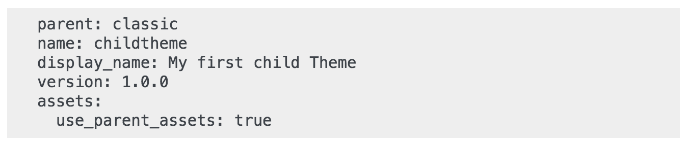

# Theme and Logo

## Adaptation to Right-to-Left (RTL) languages 

_New since PrestaShop 1.7.3!_ PrestaShop supports Right-To-Left (RTL) languages. Not only the back office and its themes are now fully RTL compatible, but we are also introducing RTL stylesheet generation for front office themes. This means that any front office theme can now be automatically converted to be RTL-compatible. This is extremely important for selling in countries that speak in RTL languages like Arabic, Hebrew, or Persian.

 (1) (3).png>)

## Logos 

Changing your shop's logo is often one of the first steps performed when customizing the design of your store. You can modify your shop's main logo but not only, thanks to these three different tabs:

* **Header logo**. The logo that will appear on all the pages of your shop.
* **Invoice & email logos**. The logos that will respectively appear in your shop's email notifications and invoices.
* **Favicons**. Your shop's favicon. It is the small image displayed at the left of the web browser's address bar and on the browser's tabs.\
  \
   (1) (3).png>)\
  \

The default theme uses a "Classic" logo and PrestaShop's logo as a favicon. It is strongly recommended to change all of the instances of these logos and use yours instead!

In multistore mode, you can apply these changes to all your stores or a group of stores at one time, using the multistore menu.

## Your current theme 

The first section of the page serves as a reminder of which theme you are currently using, with its details:

* Theme name and version.
* Theme author's name.
* Thumbnail for the theme.\
  \

 (4).png>)

### Configure your page layouts 

Depending on your theme's options you can customize each kind of page layout: whether it should have columns or not, how many, with different sizes, and so on. By clicking on "Choose layouts", you will see a new page listing all the kinds of pages available on your site (category, product, cart, etc.). For each page, you can change the default layout.

For the default PrestaShop theme, "Classic", the available options are:

* Full width - No side columns, ideal for distraction-free pages such as product pages.
* Three Columns - One large central column and 2 side columns.
* Two Columns, small left column - Two columns with a small left column.
* Two Columns, small right column - Two columns with a small right column.

Click "Save" to keep your changes. In case you want to revert your modifications and go back to the default settings, simply click the "Reset to defaults" button on the "Theme & Logo" page.

### Select a theme for your "\[name]" shop 

This section is only displayed if you have at least two themes installed. It presents you with the other available themes on your PrestaShop installation beside the already-enabled one.

This section simply shows the thumbnails of the available themes, with their names. Move your mouse cursor over the thumbnail to display a menu with two options:

* **Use this theme**. This will replace your current theme with this theme.
* **Delete this theme**. This will delete this theme's files from your web server.\
  \

In multistore mode, you cannot apply a theme to all your stores or a group of stores; you must select a single store in the multistore menu, then pick a theme.

### Adding a theme 

You can import a theme and install it (and its attached modules) thanks to the "Add new theme" button. By clicking it, a new screen will open. This screen presents you with 3 methods to install a new theme. A final button leads you to the theme creation form, presented in the next section.

 (2) (3).png>)

Whatever the method, the process remains the same: indicate the location of the theme's Zip archive, then click on the "Save" button. Here, the only thing that changes is the source of the Zip file:

* **Import from your computer**. Use the file explorer to find the archive.
* **Import from the web**. Indicate the direct public URL to the archive.
* **Import from FTP**. Using your FTP client, upload the archive in the following folder: `/themes/`.

Click "Save" to validate your choice: the theme is now installed. Click "Save" one last time. A final confirmation page presents you with all the changes applied to your PrestaShop installation. Click "Finish" to end the process.

### Exporting a theme 

This section is only available when there is at least one theme installed on your PrestaShop site. Exporting a theme is very useful when you want either to back the theme up for safety and create an archive of the theme for a friend or in order to make it available on the [Addons marketplace](http://addons.prestashop.com). Not only does it generate a complete Zip archive of your theme, but it also adds the custom modules that your theme requires, which is very useful both when uploading to Addons, and when importing to another PrestaShop site.

The export option works only for the current theme. Click "Export current theme" to export the theme used by your shop. Your theme will be compressed in a .zip file and the confirmation message will tell you where to find it in your theme folder. Save the archive on your hard-drive to be safe. From there on, you can easily share this theme, and if it is your own creation, you can start selling it on the [Addons marketplace](http://addons.prestashop.com).

### Live from PrestaShop Addons! 

If you are looking for a new theme, PrestaShop Addons is where you should go! Thanks to this section, you can browse through the most popular themes to get inspired. If you wish to see more themes, click "Discover all of the themes" to be directed to the full selection of PrestaShop themes, as available on our official marketplace, PrestaShop Addons.

By clicking "Discover" for a given theme, a new page from PrestaShop Addons will open, with more details are this specific theme. You can also use the search bar at the bottom of the page to find the theme that best suits your store.

## Pages configuration

The "Theme Customization" module allows you to easily customize the front office pages of your store.&#x20;

You can customize the **homepage**, the **category page**, and the **product page**.&#x20;

On the left side of your screen is displayed a simplified illustration of the selected page. On the right side, a mirrored view shows the module selection you need to configure for the modification.

Click on the part of the page you want to modify to know which module(s) need to be configured to make the change. Then, click on "Configure" to access the module page and proceed with the modifications.

See the GIF below to see an example of how to modify your homepage slider.&#x20;

.gif>)


Please note that the "Theme Customization" module only works with the PrestaShop default theme and with PrestaShop built-in modules.&#x20;


## Advanced customization: parent / child theme 

This is a feature introduced with PrestaShop 1.7 and it is only useful if you want to slightly modify a theme (to add a block for example), but still make sure you can update it easily. Indeed, if you modify a theme directly in its folder, the risk is that when the theme is updated, your changes could be incompatible with the update.

 (4) (3).png>)

Thanks to the child theme, you are able to customize the parent theme and at the same time, you can benefit from its updates.

Using a child theme can be a bit technical. To see how you can use a child theme in details, please refer the developer documentation: [https://devdocs.prestashop.com/1.7/themes/reference/template-inheritance/parent-child-feature/](https://devdocs.prestashop.com/1.7/themes/reference/template-inheritance/parent-child-feature/)

### Creating a child theme 

First, you need to have the theme you want to use as a parent in your store `/themes` folder. Then you can create a new folder with a very minimal theme, containing only the following files, which you can copy directly from the Parent theme:

 (7) (3).png>)

Once you have this, you will specify in your child theme `theme.yml` which theme should be used as a parent (in the example below, we chose PrestaShop's default theme, Classic). The value must be the theme technical name (ie: the theme folder name). Add the following information the `theme.yml` file:

You can now use this theme in your back office and edit it as you wish.

Are you creating themes so good that other merchants could pay money for it? You can sell it on [Addons](http://addons.prestashop.com), PrestaShop's official theme & module marketplace.
