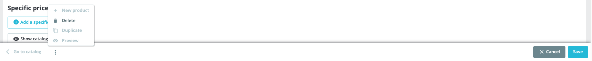

# Currencies

PrestaShop supports a large number of currencies. By default, only one currency is registered for your store, i.e. the currency of your store’s default country. However, you can add and configure new currencies to better meet your customers’ needs. Indeed, customers will appreciate being able to shop in their own currency!&#x20;

## **Changing the default currency**&#x20;

All the exchange rates of the added currencies (official or alternative) are calculated from one unit of your store's default currency. That's why the default currency should be the currency in which you are most comfortable.

To change the default currency of your store:

1. Go to the International > Localization page
2. See the ‘Default currency’ feature in the Configuration section
3. Select the currency you want to set as default

If the currency you want to set as default is not available, you must add it whether by importing the localization pack of a country using this currency or by completing the “Add a new currency” form (See “Adding a new currency”).&#x20;

## **Adding a new currency**

There are two ways of adding a new currency:&#x20;

### 1. Import the localization pack of a country using this currency

This can be done in the "Localization" page of the "International" menu.&#x20;

For example, if you want to add the Algerian Dinar, you can import Algeria’s localization pack.

When importing a localization pack, the language and the currency will be enabled by default. Once imported, you can manage the status of the currency on the “Currencies'' page.&#x20;

### 2. Add the currency manually

Click on the "Add a currency" button. Select the currency you want to add from the list. The fields will be filled in automatically.&#x20;

By default, the currency is disabled. To activate it in your store, do not forget to switch the Status button to “Yes” and save.

## **Creating an alternative currency**&#x20;

You may need to add a currency that is not included in any of the localization packs or that is not available in the list of currencies. Use this feature to add any cryptocurrency, local currency, etc. that meet your customers’ needs.

1. Click on the “Add a new currency” button
2. Check the box “Create an alternative currency”&#x20;
3. Complete the fields:

* **Currency name.** Enter the name of the currency.&#x20;
* **ISO code.** Enter the currency 4217 ISO code. See [Wikipedia ](https://en.wikipedia.org/wiki/ISO\_4217#Active\_codes)for more information. You will also be able to find unofficial ISO codes of alternative currencies, such as Bitcoin.
* **Exchange rate.** This rate is to be defined according to your store's default currency. For example, if the default currency is euros and your chosen currency is dollars, type "1.20" (1€ = $1.20).
* **Decimals.** Number of digits following the decimal point for the prices on your store.
* **Status.** Any currency can be disabled at any time, both from the edit page, and the currencies listing on the "Currencies" page. When you create a new currency by using the “Add a new currency form”, it is disabled by default.&#x20;

## **Editing symbols and format**&#x20;

You can customize the format and the symbol of each currency depending on the languages of your store (both the activated and deactivated ones).

When editing a currency, at the bottom of the page, choose the language for which you want to modify the currency symbol and/or format and click on “Edit Symbol/Format”.&#x20;

Enter the currency symbol and choose the format:

* just in front of the amount, e.g. □999.99
* in front with a space between the symbol and the amount, e.g. □ 999.99
* just after the amount, e.g. 999.99□
* after the amount with a space between them, e.g. 999.99 □

The white square will be replaced by the currency symbol once the “Symbol” field is filled in.

Please note that this feature is only available when editing a currency.&#x20;

## **Updating currency rates**

A currency exchange rate, or conversion rate, is the rate at which one currency will be exchanged for another. For example, a conversion rate EUR/USD of 1,22 means that 1 euro equals 1,22 dollars.

If a product costs 15 euros, it will cost 18,30 dollars. (15\*1,22 = 18,3)&#x20;

On the contrary, if a product costs 15 dollars, it will cost 12,30 euros. (15/1,22 = 12,3)


Rates on PrestaShop are provided by the ECB ([https://www.ecb.europa.eu/home/html/index.en.html](https://www.ecb.europa.eu/home/html/index.en.html)) and updated every day. However, note that they might slightly differ from the current ones as these rates can fluctuate greatly in a short time.


Do not forget to regularly update the rates, by following these steps:&#x20;

Clicking on the “Update” button will automatically update the exchange rates of your store’s currencies :

1. Go to the “Exchange rate” section of the “Currencies” page
2. Click on the “Update” button&#x20;


Custom currencies’ exchange rates will not be updated automatically, so you will have to manually update them. For example, if you added Bitcoin and want to update the exchange rate, click on the pencil to modify the currency in the Currencies listing, and enter the exchange rate in the corresponding field. Therefore, for high volatile alternative currencies, it is highly recommended to use a module that can automatically update the currency rate.


\
A simple search on the internet is usually sufficient to find a currency exchange rate. There are a lot of converters online that you can use, such as XE.com:&#x20;

[https://www.xe.com/currencyconverter/convert/?Amount=1\&From=XBT\&To=USD](https://www.xe.com/currencyconverter/convert/?Amount=1\&From=XBT\&To=USD)

For cryptocurrencies, you can visit the following websites: [https://coinmarketcap.com/](https://coinmarketcap.com/) \
