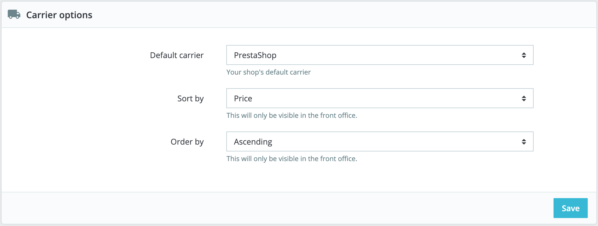

# Shipping Preferences

The more general settings of your shop's shipping configuration are found in the "Preferences" page, under the "Shipping" menu. This page provides handling charges settings:

 (4) (3).png>)

* **Handling charges**. Enter the per-order handling expenses, which will be added to the final purchase price. This is separate from your shipping costs: it is really the cost of you or your employee having to fetch the products, package them and have them shipped. If there is no such cost, leave it at 0.
* **Free shipping starts at**. Enter the _price_ and/or _weight_ after which your customers will receive free shipping. For instance, you might choose to offer free shipping when the order exceeds $250. A message will appear to your customers indicating how much more money they need to spend in order to receive free shipping. If you do not want to offer free shipping and you do not want this message to appear, leave these values at 0.

The "Carrier options" section gives you access to 3 settings, which impact the front office in order to help the customer make a choice:

* **Default carrier**. If you have more than one carrier in your system, you might want to promote one to your customers. Besides the carriers themselves, this drop-down list has two contextual options:
  * _Best price._ Depending on the amount of the order, on its weight and its delivery zone, PrestaShop will choose the cheapest price for the customer.
  * _Best grade._ Speed grades make it easier to identify the fasted carriers. PrestaShop will display the carrier which, within the context of the order, will have the shortest shipping delay.
* **Sort by**. When customers are presented with a choice of carriers, you can choose to either sort the list by shipping price or by their position, as set in the carrier list on the "Carriers" page.
* **Order by**. This enables to set the order in which the carriers are sorted:
  * If sorted by shipping fee and with an ascending order, then carriers will be displayed from the cheapest to the most expensive.
  * If sorted by position and with a descending order, then carriers will be displayed from the top position of the list, to the bottom position.
