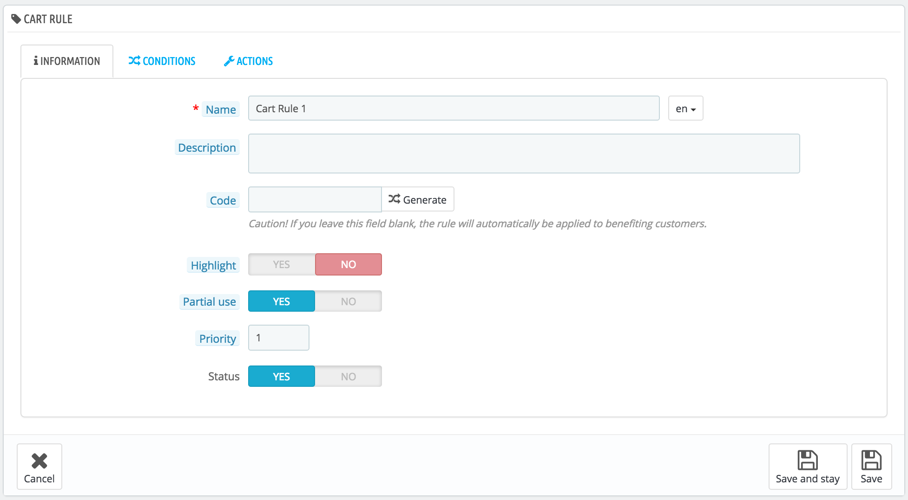

# Cart Rules

The "Cart rules" page gives you access to an advanced tool to create very precise vouchers. When this guide mentions vouchers, we are actually talking about cart rules – which, in themselves, are quite different to credit slips.

Differences between a credit slip, a voucher and a cart rule

A **credit slip** is first and foremost a written proof that a product has been returned. Most of the time, the user can use it as a voucher.

A **voucher** is a discount code which does not have to be tied to a merchandise return or a refund, and which can take more forms than a simple credit slip:

* A discount on an order (percentage).
* A discount on an order (amount).
* Free shipping.

You can apply a voucher to all customers, a group of customers, or a single customer; you can set its expiration date.

A **cart rule** is basically an advanced version of a voucher:

* Name the discount.
* Allow the customer to use only a portion of the discount.
* Assign priorities between cart rules.
* Set the compatibility between cart rules.
* Have the discount only work with some carriers.
* Have the discount only work with a selection of products and/or categories and/or brands and/or suppliers and/or attributes... or all of these at the same time if necessary!
* Have the discount be applicable for free shipping and/or a discount on an order and/or a free gift... or all of these at the same time if necessary!

In this user guide, "cart rule" and "voucher" are synonymous and interchangeable.

The "Cart rules" page lists the currently existing cart rules and vouchers, which you can enable or disable by clicking on the icons in the "Status" column.

 (3) (2).png>)

## Creating a new cart rule 

A voucher can be created automatically after a product return, but you can create a new voucher at any time manually, and be very specific about its properties. For this, click on "Add new cart rule". The creation form has three tabs, enabling you to precisely build new rules and vouchers.

### Information Tab 

The first tab, "Information", contains the rule's identifiers and main settings.

* **Name**. The name is public, so you should keep it casual.
* **Description**. The description is not public. It helps your shop employees understand why the rule was created.
* **Code**. Give your rule a unique code. You can either create one manually (and therefore use readable words, like 1VOUCH4JOE), or have PrestaShop generate one unique string by clicking the "Generate" button. Of course, you can also use any other string generator (such as [http://www.random.org/strings/](http://www.random.org/strings/)).\
  Note that if no code is set, the rule will apply to any customer fitting the other conditions:
  * If there is a code, then customers have to enter it during the ordering process.
  * If there is no code, then the rule is automatically applied to benefiting customers at checkout.
* **Highlight.** If enabled, PrestaShop will let the user know that a voucher corresponding to the items in the cart is available and can be added.
* **Partial use**. If disabled, the rule/voucher can only be used once, even if it is not completely used. If enabled, a new voucher is created when the current one is not completely used.
  * It is only applicable if the voucher value is greater than the cart total. If you allow partial use, a new voucher will be created with the remainder.
  * If you do not allow partial use, the voucher value will be lowered to the total order amount.&#x20;
* **Priority**. If a customer (or group of customers) is eligible for more than one voucher, or if more than one voucher can be applied to an order, then PrestaShop applies said voucher one by one in the alphanumerical order. You can change that order by placing a lower priority on your voucher. By default, they all have a priority of 1. If you set it to a higher number, the voucher will be applied after vouchers with a lower number.
* **Status**. You can disable and enable a rule whenever you feel is necessary.

### Conditions Tab 

The second tab, "Conditions", contains a large set of possibilities, enabling you to target precisely who should be able to benefit from this rule.

 (7) (6).png>)

* **Limit to a single customer**. This is where you indicate that the voucher you are creating is for one customer only. For instance, if you had a delivery delay and you want to make a gesture of goodwill, you can create a voucher for this customer that only he or she can access. To quickly find the customer, type in the first few letters of their first name, last name or e-mail in the text field.\
  If empty, PrestaShop will understand that any customer can use it... unless you have added a customer group as a further condition (see "Customer group selection" checkbox below).
* **Validity**. The default validity is one month, but you can reduce that to one week or even one day.
* **Minimum amount**. The minimum order amount from which the voucher is applicable. Your voucher will only be applicable if the customer's order is above the given amount. You can choose if that amount should include taxes and/or shipping costs.
* **Total available**. Set a quantity of available vouchers: either "1" if it is intended for a single customer, or any number if the voucher is for whoever uses one first.
* **Total available for each user**. You can set the number of times a voucher can be used for each user. That number must be at least equal to the quantity of available vouchers above ("Total available" field).
  * If that number is inferior to the total quantity of available vouchers, then one single customer will not be able to use all of them.
  * Keeping it to "1" makes sure that each of your customers can only use the voucher once. In that case, make sure the voucher applies to a group rather than a customer...

The checkboxes at the bottom of the section are very important, as they help you further filter to what or to whom the rule is to be applied.

 (3) (2).png>)

* **Carrier selection**. You can make it so that the customer will have a discount if he or she chooses a specific carrier for the package delivery.
* **Customer group selection**. This is very useful. Thanks to PrestaShop's group creation tool, you can create discounts that apply to a range of users, and build other conditions on top of that discount thanks to the cart rule creation tool.
* **Compatibility with other cart rules**. By default, an order can benefit from any number of cart rules. With this option, you can tell PrestaShop that this rule cannot be combined with a selection of other rules. This option only appears if you have more than one cart rule.
* **Product selection**. Another very useful tool, which enables to create automatic vouchers for a cart which contain specific products. The tool is explained in more detail below.
* **Shop selection**. When the multistore mode is enabled, by default a cart rule applies to all your stores. With this option, you can make it so that a rule only applies to a selection of your stores.

The "Product selection" option brings a whole new form and enables you to create not only per-product vouchers, by also per-categories, per-brands, per-suppliers and even per-attribute ones. As a bonus, you can combine all these in order to specify your customer target as much as possible.

For instance, you can create automatic vouchers for your customer in the form "Buy at least 3 Apple product, get free shipping!". This is really a tool within the cart rule too, and its configuration is quite specific. You can add as many product selections as needed, following this path:

1. Click the "Product selection" link to add a new section.
2. Indicate the number of products needed for the discount to activate.
3. Add at least one rule, of the type you want: products, attributes, categories, brands, suppliers. You can add as many rules per product selection as you want, even one for each type if necessary.
4. Clicking the "Add" button adds a new line in the selection. For each type, you must give details on the content the rule applies to. Click the "Choose" link and a window opens, listing the content available for this type (products, categories...). Move the content from the left panel to the right one by clicking on the "Add" button, and close the window by clicking on the "X" at the top right. If only one content is selected, the content field will give its name; otherwise, it will indicate the number of selected content.

You can add as many rules within a selection as necessary. These rules are cumulative: either they all apply, or the discount is not granted.

Product selections are independent: you can add as many as needed, and they will not influence each other. This enables you to create a whole range of products to which the cart rule will apply.

### Actions Tab 

The third and last tab, "Actions", is where you choose what the discount actually consists of.

 (3) (2).png>)

* **Free shipping**. The rule treats benefiting customers to free shipping.
* **Apply a discount**.
  * _Percent (%)._ The rule applies to a percentage of the order total. For instance, let's say the order is valued at $200 before taxes. The rule has a value of 15%. Customers who benefit from this rule will only have to pay $170 (before taxes and shipping costs).
  * _Amount._ The rule applies a monetary discount on the order total. For instance, let's say the order is valued at $200 before taxes. The discount offers $20 off the purchase. Customers who benefit from this rule will only pay $180 (before shipping costs). You can choose whether taxes are applied to the discount or not.
  * _None._ The rule does not offer any discount on the order. Choosing this option makes the next section, "Apply a discount to", disappear.
* **Exclude discounted products**. **** _New in PrestaShop 1.7!_ By default, the voucher applies to any kind of product, whether it is already discounted or not. By enabling this feature, the voucher you are creating will not be applied to a product or a combination if it already on sale.
* **Send a free gift**. You can choose to offer a gift for some conditions (and skip the discount altogether). A field appears: type the first letters of the product, and choose from the list of matching names.

Once everything has been saved, you can send your voucher code to your customers, or let the system handle the cart rules automatically, depending on your settings.

Your voucher will appear in the "Cart Rules" page, under the "Price rules" menu. You can delete or edit it at any time. If the voucher was set to a specific group or customer, then it will appear in the front office, in the customer's "Vouchers" section of his account as well as in the cart (if you chose to), where they can choose which one to apply to their order.

 (3).png>)

 (3) (2).png>)

Cart rules that are set to apply to all customers do not appear in the customer's "My vouchers" page: he or she has to know about them in order to use them. It is up to you to let them know about these public discounts.

In order to apply the cart rule, the customer needs to visit his cart and enter the voucher in the "Have a promo code?" field and click "Add". The customer will not be able to apply the voucher if the check-out is already validated.

Once applied, the cart summary displays the voucher's impact on the order's amount.
