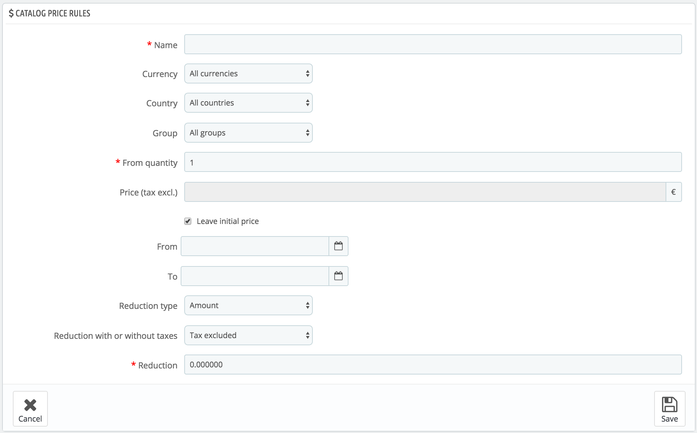

# Catalog Price Rules

Catalog price rules enable you to assign price reductions by category, brand, supplier, attribute or feature. As its name implies, this type of rules applies to a range of products; it cannot be used for a single product. If you need a discount applied to a single product, you must create a cart rule instead or create a specific price (in the "Pricing" tab of the product's edition page).

For instance, you can set a rule that would say that for Spanish customers belonging to the "Good clients" group would get 10% off on your electronics category and all Sony products for the first week of July.

The "Catalog price rules" page lists the currently existing rules, which you can edit or delete by clicking on the action buttons. If you need to disable a rule, simply change its end date to the day before.

## Creating a new catalog price rule 

The creation form page has two sections, enabling you to precisely build new rules.

### Catalog price rules 

The first form is easy to understand.

This is where you set who should benefit from the rule, what the discount should be, and other details.

* **Name**. The name is public, so you should keep it casual.
* **Shop**. _Multistore mode only!_ The rule applies to customers who buy through a specific shop. Only available if you have at least two shops.
* **Currency**. The rule applies to customers who set to pay with a specific currency.
* **Country**. The rule applies to customers from a specific country.
* **Group**. The rule applies to customers who belong to a specific customer group.
* **From quantity.** The rule applies if the order has at least a specific number of matching products.
* **Price (tax excl.).** The new price for the product selection. Here you can set the public price of the products that match the rules that you are putting in place. By default, the rule applies to the price initially set.
* **From and To**. The rule applies in this time frame.
* **Reduction type.** The discount can either be an amount of money or a percentage of the order total.
* **Reduction with or without taxes.** The discount can either include the tax or leave the tax as is.
* **Reduction**. The value of the reduction. Depending on the "Reduction type" above, putting "10.0" in the field can either mean "$10 off" (depending on the default currency) or "10% off".

Of course, you can combine all of these rules.

### Conditions 

The "Conditions" section is where you set the products to which the category price rule applies. It only appears if you click on the "Add a new condition group" button.

If no conditions are set, the price rule will apply to ALL products of your catalog. Be careful not to forget the conditions!

 (3) (2).png>)

Conditions are built around condition groups, meaning that your data from the "Catalog price rule" section above can be applied to many different ranges of products. Conditions are grouped in an inclusive manner: all conditions of the group have to apply for the catalog price to apply. Hence the "AND". Meanwhile, condition groups are exclusive: only one group has to apply for the catalog price to apply. Hence the "OR".

The default condition group is empty. You can add conditions to it using the drop-down menus in the lower part of the section:

* Choose a category or any other type of selection, and then click on the "Add condition" button.
* The condition will appear in the condition group. You can put many conditions in a condition group.
* Once a group is completed and you want to create a new condition group, click on the "Add new condition group". A new group will then appear, which you can fill in the same way.

By default, new conditions are added to the condition group that was created last. If you need to add conditions to a previous group, click on that group to highlight it, and then add your conditions.

You cannot currently delete a condition group.
