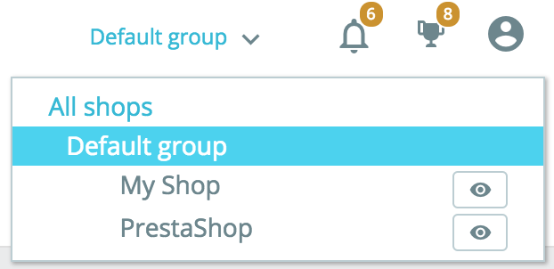

# Stock Overview

This tab contains a table presenting your products' stock, as well as search options and allows you to directly edit your products' quantities.

 (3).png>)

A table allows you to have an overview of your catalog stock at a glance.

 (3) (2).png>)

Each line represents a product (either standard, virtual or bundle) or one of its combinations. The only difference is that combination attributes are displayed just below the product’s name.

The table contains the following columns:

* Image thumbnail, to help fast visual recognition.
* Product’s name and when it’s a combination, its attributes’ values.
* Product reference. In case a combination has its own reference then it’ll be used instead of the parent’s reference.
* Supplier. In case several suppliers are assigned to a product, only the default supplier will be shown here.
* Status, to know if the product is enabled or not.
* **Physical stock**, which represents the quantity you actually have physically in your storage.
* **Reserved stock**, which represents the quantity of products that are currently in an open customer order that has not been shipped yet.
* **Available stock**, which is the quantity available for sale.
* Edit quantity. This input allows modifying the quantity manually. See [below](stock-overview.md#Stockoverview-qty\_edition).

Understanding the notions of physical, reserved and available stockStarting from version 1.7.2.0, PrestaShop introduces three different notions of stock, which are different from the ones used in Advanced Stock Management in the 1.6 versions.

* **Physical stock** represents the quantity you actually have physically in your storage. You may add or remove physical stock, for instance when receiving a supply order or when doing an inventory adjustment.
* **Reserved stock** represents the quantity of products that are currently in an open customer order that has not been shipped yet. In other terms, these products are physically in your storage but are not available for sale anymore. You cannot change directly the reserved stock. The reserved stock only depends on customer orders.
* **Available stock** is the quantity available for sale. Unlike with Advanced Stock Management in version 1.6, you cannot directly modify the available stock unless you change the physical stock as well. This is the quantity displayed in the ["Product" page](../managing-products.md).

Relation between physical, reserved and available stock

At any time, these 3 notions of stock are linked by the following equation:

_Physical stock - Reserved stock = Available stock_

Editing __ the physical stock will also affect the available stock, and vice-versa.

&#x20;By default, products are sorted by decreasing product\_id, meaning that the most recently created product will be on top. If there are more than 100 products and combinations, then the table is paginated.

### Edition of quantities 

Quantities can be modified directly in the "Stock" tab, with the input field located in the end-right column of the stock overview table.

#### Simple edition 

To edit a single product's stock, simply enter the desired quantity change in the input field. What you’re typing in this input is a quantity delta, meaning it’s not the desired final stock value but the quantity you’re adding or removing. You can either type in the quantity to add or to remove (with a minus sign), or use the up and down arrows to adjust the quantity.\
 (2).gif>)To validate the new stock, simply click on the blue "Check" button inside the input field, or use the "Apply new quantities" button at the top of the stock overview table.

While editing the quantity, you’ll see an overview of the resulting final stock: (3) (2).png>)This feature is here to help you see at the same time the starting point, the endpoint and the difference between those before validating. Remember that since physical and available stock are always linked by the equation showed earlier, you'll edit both at the same time.

#### Multiple edition 

If you want to edit multiple quantities at the same time, you can also edit the quantities of several products and then validate it all with the “Apply new quantity” button. (5) (2).gif>)

#### Bulk edition 

Since PrestaShop 1.7.3, product stock information can now be updated in bulk instead of one by one. And it is very easy, all you have to do is check (in the left column) all the products you want to edit, enter the quantity to add or subtract to the already available stock and confirm!

### Low stock alerts  

Also, when a product is low on stock, you can ask PrestaShop to send you alerts. You can configure the low stock threshold as well as toggling the notification either globally in the "[Product](http://doc.prestashop.com/display/PS17/Managing+Products)" page or per product. And then, in this stock overview page, products with a quantity under the low stock level are now highlighted. A quick filter has been added too, which allows you to quickly see products low on stock by placing them at the top of the list.

 (3) (2).png>)

### Search and filter options 

At the top of the tab, you’ll find two features to quickly look for any product. The search bar is designed for use-cases where you know which product you’re looking for because you either have in mind its reference, name or supplier. While the advanced filters allow you to browse more options to fine-tune your search.

#### Search bar 

The search bar looks for:

* product’s name
* product’s reference
* supplier
* **\[**_**beta as of 1.7.2.0**_**]** attributes’ values. This allows you to look for a specific attribute value like color. When typing ‘green’, you’ll see all products which share this color attribute value. This is still in beta though, and might not work with too short attribute values like with sizes: ‘S’, ‘M’, ‘L’.

 (5) (2).gif>)

#### Advanced filters 

In the ‘Stock’ tab, advanced filters contain:

* a supplier filter, which allows you to quickly browse available suppliers and choose one or several.
* a category filter with an expandable tree.

 (3) (2).png>)

## Import / Export 

Because your shop deals with a lot of data, PrestaShop allows you to import or export the information displayed in the Stock Overview page in a CSV file. Why? So that you can work on it with your computer, connect to your own stock management system… you name it! You just need to click on the blue cloud icons on the right-hand side of the screen and you’ll be on your way to the import/export system.

## Multi-store 

This new stock management system is compatible with multi-store. For obvious reasons, if you have multiple shops inside a group where stocks are not shared, you cannot manage your stock in “all shops” or “group” context. If you try to do so, you might see the following error message:

 (3) (2).png>)

Instead you have to select a shop in which you can work to edit its stock.\

If you’re using a group of shops that share the same quantities, you’ll also have to select a unique shop context instead of a group but any change you make in a shop will also affect the other shops.

