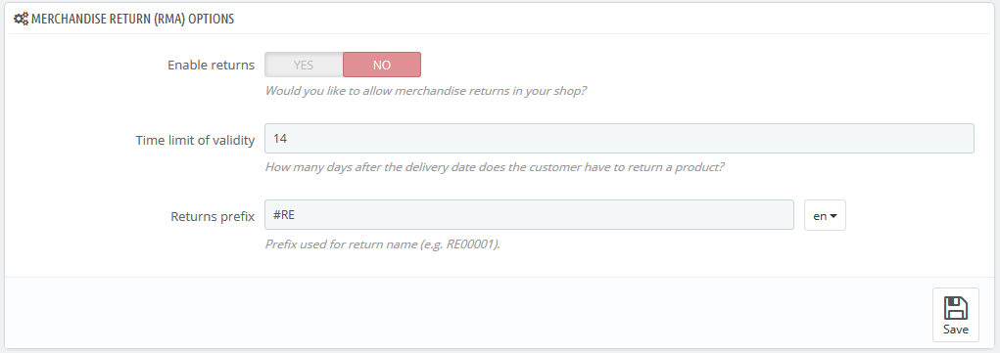
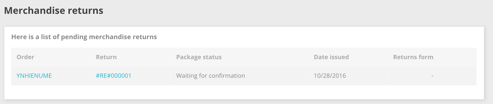

# Merchandise Returns

The "Merchandise Returns" page gives you a list of all the RMA process (Return Merchandise Authorization).

At the bottom of the page, you have the possibility of enabling customers to send products back to you ("Enable returns" option). Simply make a choice, indicate the number of days during which a return request can be made, and save your settings: customers now have the ability to ask for a return authorization. You can also edit the prefix for the return number, or chose not to have any.

## Return process: how the customer sees it 

Once you have activated the returns option in your back office, the customer can choose to return an item (provided the order is still in the time of validity). In order to do this, he/she must do the following:

1. Access the "Orders history" section of his/her account.
2. Select the order from which he/she wants to return an item by clicking on "Details".
3. Select the product(s) that he/she wishes to return by checking the box next to its name(s).
4. Add the quantity that needs to be returned (in case more than one product need to be returned).
5. (optional) In the "Merchandise return" section, add an explanation, in order for the shop team to better understand why the customer wants to return this product.
6. Click on "Request a return".

 (3) (2).png>)

When is it possible to return an order?

1. Returns have to be enabled ("Enable returns" option).
2. The order has to be in the time of validity (= it is still time to return a product).
3. The orders need to have had at least the following statuses:

*
  * At least two statuses: one with the condition "Set the order as paid" enabled and the second one with the option "Set the order as shipped" enabled.\
    Or
  * One status which has both conditions ("Set the order as paid" and "Set the order as shipped") enabled.

Statuses can be edited on the "Statuses" tab under the "Orders setting" page of the "Shop parameters" menu.

Once the form is complete, the customer clicks on "Request a return", and the request is sent to the store manager (you). The request appears as "Waiting for confirmation" in the customer's "Merchandise Returns" page, accessible from the account page.

## Return process: how you see it 

The return request appears in your back office in the "Merchandise Returns" page. At first, the return request has the "Waiting for confirmation" status.

The refund process can take several steps, which are indicated by the return status. It can be either:

* Waiting for confirmation.
* Waiting for the package.
* Package received.
* Return denied.
* Return completed.

 (3) (2).png>)

It is now up to you to accept it or deny it:

1. Click on the return request ID to see more details.
2. Change the status to continue with the return process or stop it.
   * If you want to stop the return process (and deny the customer a refund), simply choose the "Return denied" status.
   * If you agree with the product being returned and the customer being refunded, follow each step precisely:
     1. Choose the next step in the process: "Waiting for package". This will send an email to the customer indicating that the product can be sent back to you.
     2. Once you have received the package, change the request's status to "Package received".
     3. Finally, once the whole process is over (either the customer has been refunded or you have issued a credit slip), change the status to "Return completed".
3. Save.

## Refunding a customer 

An order can be refunded, either partially or totally. This is done using two actions buttons located in the top bar of the order's page itself rather than in the return page**.**

The action buttons change depending on the order's status. For instance, once the order is in the "Delivered" state, the "Add a product" and "Remove products" turn into two new buttons: "Return products" and "Partial refund".

Product returns are not activated by default. To activate it, go to the "Merchandise returns" page under the "Customer Service" menu, and activate the option in the options section at the bottom of the page. This will apply to all products and all orders.

 (3) (2).png>)

* **Return products**. To be used only when the customer has effectively returned products: once the returned product has been received, you can mark it as returned directly in the order form. \
  Click the "Return products" button and a new column will appear in the product list, titled "Return". Check the box of the affected products, indicate the number of items that were returned, and click the "Return products" at the bottom of the table.
* **Partial refund**. To be used when you need to refund only part of the order and not the whole order, either because the customer returned the ordered product, or simply as a sign of goodwill for a damaged product that the customer chose to keep anyway. Click the "Partial refund" button and a new column will appear in the product list, titled "Partial refund". Set the amount and quantity for each of the affected products, choose one of the options at the bottom of the list (see below), and click the "Partial refund" button at the bottom of the table.\
  \

When you set a product as returned or to be refunded, four options are available below the list of products:

* **Re-stock products**. When checked, PrestaShop will consider that the returned product is available for sale again, and will therefore increase the stock for this product. You should not click this when a product is returned due to it being broken...
* **Generate a credit slip**. When checked, a credit slip will be created for the selected items. A credit slip is an acknowledgment from your shop that merchandise has been returned and that a refund has been issued. The customer can then use it as a credit slip for his or her next purchase.
* **Generate a voucher**. When checked, a voucher will be created for the amount of the selected items. A voucher takes the form of a discount code that the customer can enter during the checkout process. You can edit the customer's existing vouchers by viewing the customer's page: from the current order's page, click on the customer's name in the "Customer" section; once in the customer's page, reach the "Vouchers" section. You can edit each voucher by clicking on the "Edit" icon.
* **Repay shipping cost**. You can also choose to refund the shipping cost of the returned product, which is always an appreciated gesture.\
  \

If the customer paid the order using a credit card, the payment system may refund the cart automatically, or you may have to do it yourself. If the order was paid using a check or a bank transfer, you have to issue the refund yourself, then mark the order as having been refunded manually in the back office (in the order's page).
