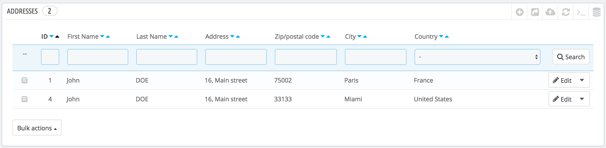
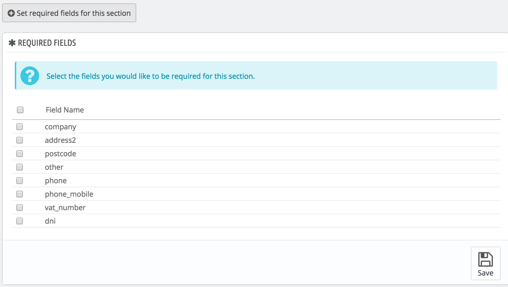

# Customer addresses

By clicking on the "Addresses" page, you will have access to the list of your customer's addresses (home, work, etc.). You can edit them using the "Edit" button, or delete them altogether.

Below the addresses table is the "Set required fields for this section" button. It opens a form where you can indicate if a database field is necessary or not by checking the appropriate boxes: this way, you can make it so fields such as "company" or "phone number" are mandatory when a customer is registering a new address on your shop.

## Adding a new address 

You have the possibility to create new addresses for a client yourself with the "Add new address" button. It opens a form with the kind of field you might expect.

 (3) (2).png>)

Some fields, however, require special care:

* **Customer email**. This field is essential: if you are adding an address for an existing customer, you MUST identify this customer using her/his email address. Otherwise, PrestaShop will not know who to assign this address to.
* **Identification number**. The national ID card number of this person, or a unique tax identification number. This field is of course optional.
* **Address alias**. A short description, in order to help the customer choose the correct address: "Home", "Office", "Aunt Beth's", etc.
* **Company**. The name of the customer's company, if needed.
* **VAT number**. The VAT identification number for the customer (or the customer's company).
* **Other**. Some additional information that might be useful to the shipment.
