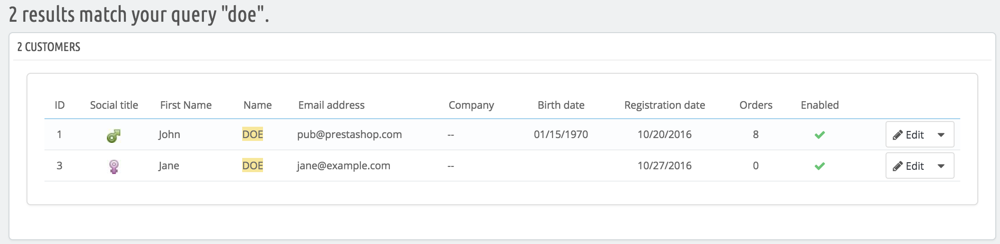

# Your customers

The first page under the "Customers" menu gives you a list of all the registered users on your shop.

 (11) (8).png>)

This gives you a bird's eye view of your customers, with some details thrown in which you can use to sort and search accounts:

* **ID.** The unique ID attached to the customer.
* **Social title**. Customers can declare their social title, which are matched with a genre and can help you better customize your customers' experience. There are two default social titles (Mr. and Mrs.), but you can create more in the "Titles" page under the "Customers settings" page in the "Shop Parameters" menu.
* **First name and Last name**. The customer's name.
* **Email address**. The email address the customer used to register on your shop.
* **Sales**. How much the customer has spent on your shop so far.
* **Enabled**. Indicates whether the customer is active or not. You can disable an account by clicking on the green checkmark.
* **Newsletter**. Indicates whether the customer is subscribed to your shop's newsletter or not. You can unsubscribe from it by clicking on the green checkmark.
* **Partner offers**. Indicates whether the account has accepted to receive e-mails from your partners or not. You can unsubscribe it clicking on the green checkmark. **Do not subscribe a user to these e-mails without their consent, as this is considered spam**.
* Registration date and last visit can always be useful when sorting user accounts.
* **Actions**. You can edit the user's account, simply view it in full (with its messages, orders, addresses, vouchers, etc.), or trash it forever.

When installed for the first time with sample data, PrestaShop has a default user, named John DOE.

You can use this fake user to test some of your shop's features, and browse your shop and see it the way a regular user would.

To log in to your shop using this public account, use these credentials:

* E-mail address: [pub@prestashop.com](mailto:pub@prestashop.com)
* Password: 123456789

**Before you open your shop to the public, make sure to delete this default user, or at least change its credentials!** If not, malicious visitors could use it to make fake purchases and more.

Below the customers table is the "Set required fields for this section" button. It opens a form where you can indicate if a database field is necessary or not by checking the appropriate boxes: this way, you can make it so fields such "partner offers" are mandatory when a visitor is creating a customer account on your shop.

You can export a list of your clients by clicking on the "Export" button at the top.\
You can also import customers using the "Import" button. You will need your CSV file to follow this format:

```
ID;Title;Last name;First Name;Email address;Age;Enabled;News.;Opt.;Registration;Last visit;
2;1;Gorred;Francis;francis@example.com;-;1;0;0;2013-07-04 15:20:02;2013-07-04 15:18:50;
1;1;DOE;John;pub@prestashop.com;43;1;1;1;2013-07-02 17:36:07;2013-07-03 16:04:15;
```

More import options are available in the "Import" page of the "Advanced parameters" menu.

## Creating a New Customer Account <a href="#yourcustomers-creatinganewcustomeraccount" id="yourcustomers-creatinganewcustomeraccount"></a>

To create a customer account manually, select "Add new customer". A form appears.

 (3) (2).png>)

Fill out the customer's information:

* **Social title**. Choose between the ones available, or create another one in the "Titles" page under the "Customers settings" page in the "Shop Parameters" menu.
* **First name**, **Last name**, **Email address**. Those are essential: the names are used in the confirmation emails that PrestaShop sends, and the email address is used for log-in.
* **Password**. Choose a password, at least 5 characters long.
*   **Birthday**. This information can be used for birthday e-mails and temporary discounts.\
    \


    If you do not want to ask for the birth date when a customer creates an account, you can disable the birth date field in the "Customer Settings" page. Simply select "No" for the "Ask for birth date" option.
* **Enabled**. You may wish to create an account, but not have it yet active.
* **Partner offers**. Can be used by modules for sending regular partner promotions to those customers who requested it. **Do not subscribe a user to these e-mails without their consent, as this is considered spam**.
* **Group access**. Having customer groups enables you to create group discounts. Many other PrestaShop features can also be group-restricted.&#x20;
* **Default customer group**. No matter how many groups that customer belongs to, s/he should always have one main group.\
  \


If your customers are mostly companies, you should enable the B2B mode in order to get additional options: go to the "Customers settings" page of the "Shop Parameters" menu, and choose "Yes" for the "Enable B2B mode" option.

 (1) (2).png>)

The B2B mode adds a few company-specific fields:

* **Company**. The name of the company.
* **SIRET**. Its SIRET number (France only).
* **APE**. Its principal activity code (_Activité principale exercée_ - France only).
* **Website**. Its website.
* **Allowed outstanding amount**. The amount of outstanding money that the company is allowed.
* **Maximum number of payment days**. The number of days that the company is allowed.
* **Risk rating**. Your risk rating of this company: Low, Medium or High.

## Viewing a Customer's Information <a href="#yourcustomers-viewingacustomersinformation" id="yourcustomers-viewingacustomersinformation"></a>

In the case where you would like to have more information on a given customer, you can click on the "view" button, located at the end of the row in the customer's list. A new page appears.

 (3) (2).png>)

The various sections provide you with some key data on the user:

* **Customer information**, first and last name, e-mail address, ID, sign-up date, date of last visit, rank.
* Information regarding the subscription to the store's newsletter and subscription to ads from partnering companies, the age, date of last update, and whether or not the account is active.
* **Private notes** from the store's employees (i.e. you or your team).
* **Messages** sent by the customer to the shop's team (through customer service).
* Available **vouchers** / cart rules.
* **Previous connections** to the shop.
* The **groups** to which the customer belongs.
* Summary of the customer's past **orders**. Amount spent, type of payment, order status. For more information about each order, click on the order's date.
* **Carts** that the customer has created (but not necessarily validated) since sign-up. When your customer is currently on your shop, you can see what is being added to the cart in real time.
* Summary of the products that were purchased by a customer. Among other things, this enables you to know when a customer is very fond of a product, and maybe create a special discount for the 10th purchase. Clicking on a product directs to the order to which that product is tied.
* A list of the **product viewed** by the customer. Likewise, you can see which product pages the customer visited on your website. If no order follows several visits of a product, maybe you can help the customer decide by sending him/her a targeted discount.
* Registered **addresses**.\
  \


## Searching for a Customer <a href="#yourcustomers-searchingforacustomer" id="yourcustomers-searchingforacustomer"></a>

Searching for a customer on your PrestaShop shop can be done two different ways.

**The first method** consists of entering the information you have into the PrestaShop search bar, which is found in the top center of your back office. By selecting "everywhere", "by name" or "by ip address", you can perform a search based on:

* ID. The numbers that is assigned to the customer in the database.
* First or last name. Note that you cannot search for both: choose either "john" or "doe", as "john doe" won't work.
* E-mail address.
* IP address. You can search using the IP of the latest connection to your shop.

 (3) (2).png>)

The results, if any, are then presented: the list presents you with the users' ID, social title, email, birth date, registration date, amount of orders and whether or not the user's account is active. From there on, you can view the whole user's page, or edit its details.



**The second method** consists of going to the "Customers" page, and listing all of your customers.

 (3) (2).png>)

On this page, you can complete the fields at the top of the list, in order to filter it according to the following criteria: ID, social title, first name, last name, email address, age, account status (enabled or disabled), subscription to the newsletter, subscription to partnering ads, registration date, and last connection date. Enter your criteria and click the "Filter" button in the top right-hand corner of the table. You can then sort the list for some of the columns.

Click the "Reset" button to go back to the complete list.
