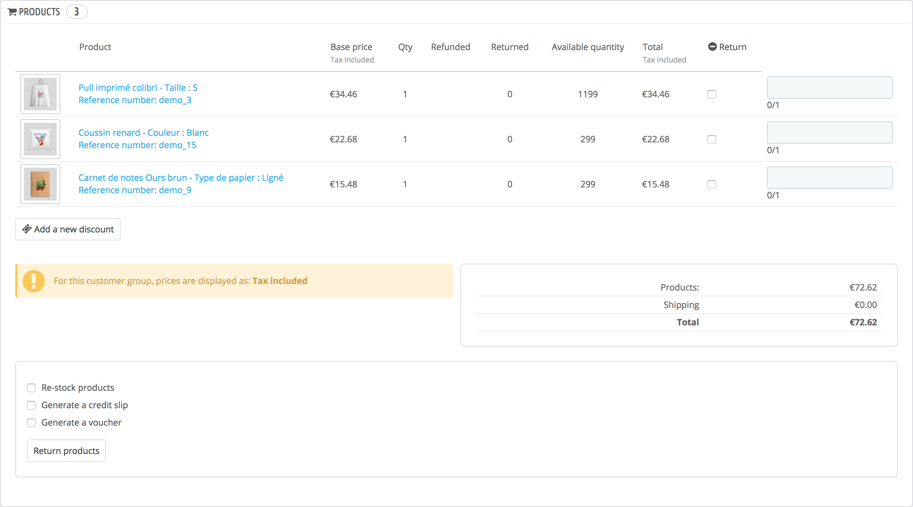

# Credit slips

Following your agreement on a product return, you should receive a package from the customer. Once you have received that package, you **must** create a credit slip from the order's page. It can also be called "credit note" or "credit memo". Credit slips are not created in the "Credit Slips" page but only listed there. This page is also used to generate a PDF of your credit slips.

 (7) (5).png>)

## Credit Slips Options 

 (3) (2).png>)

There is only one option on the page:

* **Credit slip prefix**. You might like to have language-tagged delivery slips. Of course, you can also choose to not have a prefix at all.

PrestaShop will then generate the credit slips number according to your settings.

Do not forget to save your changes.

## Creating a Credit Slip 

In your list of orders ("Orders" page), click on the order for which the customer is returning some items for more details – this will only work if have already indicated that the customer can send products back.

Below the "Products" table, do the following:

1. Check the returned item(s).
2. Check the box "Re-stock Products" if you wish to put the product back in your stock.
3. Check the box "Generate a Credit Slip."
4. To make a customer happy after committing an error in their order, consider giving him a voucher by checking the box next to "Generate a Voucher."
5. You can also reimburse his shipping costs by clicking next to "Include Shipping."

Once you have selected all the options you want, confirm by clicking on "Return products."

The credit slip is now created and will be available in the Order Details well as in the "Credit Slips" page. From there, you can click the link to download the PDF file. The customer will see the slip in his or her "Account" section.

If you have created a voucher, customers will see it in the "Vouchers" section of their account. If they click on it, it should look something like this:

 (1) (5).png>)

The amount of the returned item(s) is added to the voucher. The customer can use the discount code (listed in the far left of the column) next time he or she places an order.
