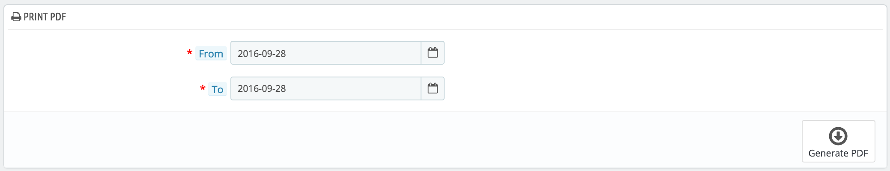

# Delivery slips

A delivery slip is a notification of delivery. It can also be called "delivery note" or "advice note".\
It is supposed to be put in the shipped package, along with the ordered products. It will have your shop's logo, and indicate the content. On receiving the package, the customer will be able to use the delivery slip in order to double-check the content of the package, see that nothing is missing from the order.

Getting a delivery slip is exactly like getting an invoice. Select the dates, as well as the options you would like, and then confirm them to create your documents.

You can get a PDF file of several delivery slips depending only by date, which is very useful when you need to print all delivery slips for a given day or a given quarter. Select the start and end date, and click on the "Generate PDF" button.

## Delivery Slips Options 

 (3) (2).png>)

The three options are the same as for the invoice options:

* **Delivery prefix**. You might like to have language-tagged delivery slips: "DE" in English, "LI" in French (for "livraison"), "EN" in Spanish (for "entrenga"), etc. Or you could directly choose to have language codes: "EN", "FR", "SP", etc. Of course, you can also choose to not have a prefix at all.
* **Delivery number**. If your business has already had orders and delivery slips before you started using PrestaShop, you can use this option to start your delivery slip number from a higher number.
* **Enable product image**. When enabled, it will display a product's image in front of the product name.

PrestaShop will then generate the delivery slips number according to your settings: "#DE000001", "#LI000002", etc.

Do not forget to save your changes.
